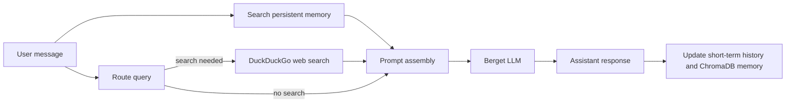

# Philosopher AI Agent

A Streamlit and terminal-based chat agent that combines long-term vector memory, web search routing, and an external LLM to generate historically grounded philosophical responses.

## Overview

This project is built around a retrieval-augmented chat loop:

1. User sends a message.
2. The agent checks persistent memory for relevant past context.
3. A routing layer decides whether the query should trigger web search.
4. Retrieved web context and memory are added to the system prompt.
5. The response is generated through the Berget chat-completions API.
6. The conversation is stored in short-term history and long-term ChromaDB memory.

The app also includes a special Philosopher Mode that reformulates prompts toward historical quotes and reflective analysis.

## Features

- Persistent semantic memory powered by ChromaDB and sentence embeddings.
- Automatic memory compaction into a running summary file.
- Web search using DuckDuckGo results for fact-heavy or ambiguous prompts.
- Crisis-aware prompt handling for supportive, resilience-focused responses.
- Streamlit UI with live memory summary and toggleable philosopher mode.
- Terminal CLI for quick local testing.
- External LLM integration through the Berget API.

## Project Structure

```text
app/
  agent.py            # Main agent orchestration logic
  chroma_db_memory.py # Persistent vector memory store and compaction
  llm.py              # Berget API client
  memory.py           # Simple list-based memory prototype
  toolbox.py          # Thin tool dispatcher
  ui_main.py          # Streamlit UI
  main.py             # Terminal chat loop
  reset_memory.py     # Reset the memory
  requirements.txt    # Runtime dependencies
  .env.example        # Template for local API key configuration
  .gitignore          # Ignores secrets and generated artifacts
  tools/
    __init__.py       # Makes the helper modules importable as a package
    routing.py        # Search routing heuristic
    web_search.py     # DuckDuckGo-based web search helper
  chroma_db/          # Persistent ChromaDB data
  summary.txt         # Stored compressed memory summary
```

## Requirements

- Python 3.10 or newer
- An internet connection for web search and the hosted LLM API
- A valid `BERGET_API_KEY`

Python packages listed in `app/requirements.txt`:

- `streamlit`
- `chromadb`
- `sentence-transformers`
- `requests`
- `python-dotenv`
- `ddgs`

## Setup

Create a virtual environment:

```powershell
python -m venv .venv
.\.venv\Scripts\Activate.ps1
```

Install the dependencies:

```powershell
python -m pip install -r requirements.txt
```

Copy the example environment file and add your API key:

```powershell
Copy-Item .env.example .env
```

Then edit `.env` and set:

```env
BERGET_API_KEY=your_api_key_here
```

## Run the App

### Streamlit UI

```powershell
streamlit run ui_main.py
```

### Terminal Demo

```powershell
python main.py
```

In the terminal version, you can toggle philosopher mode with:

```text
/philosopher
```

and exit with:

```text
/quit
```

## How It Works



### Memory Layer

- `chroma_db_memory.py` stores embeddings in a persistent ChromaDB collection.
- The same module keeps a running summary in `summary.txt` once enough interactions accumulate.
- `memory.py` is a lightweight list-based memory store kept as a simpler prototype/reference.

### Routing Layer

- `tools/routing.py` uses keyword rules first.
- If the query is ambiguous, it falls back to an LLM-based search decision.
- Clear factual queries are sent to web search.
- Philosophical or abstract prompts usually skip search.

### Web Search

- `tools/web_search.py` uses `ddgs` to fetch text search results.
- The helper filters out some blocked terms from the returned snippets before they are passed to the prompt.

### LLM Layer

- `llm.py` calls the Berget chat-completions endpoint.
- The model configured in the code is `meta-llama/llama-3.1-8b-instruct`.
- The API key is read from `BERGET_API_KEY` at runtime.

## Runtime Artifacts

The app creates or updates these files automatically:

- `chroma_db/` for persistent vector memory
- `summary.txt` for the compressed memory summary

These are ignored by `app/.gitignore` so local runs do not pollute version control.

## Notes

- The project is designed as an information-retrieval and philosophy-themed chat agent, not as a general-purpose assistant framework.
- The prompt logic includes crisis-aware behavior intended to stay supportive and avoid harmful content.
- If you want to extend the agent, the most natural places to start are `routing.py`, `web_search.py`, and `chroma_db_memory.py`.
